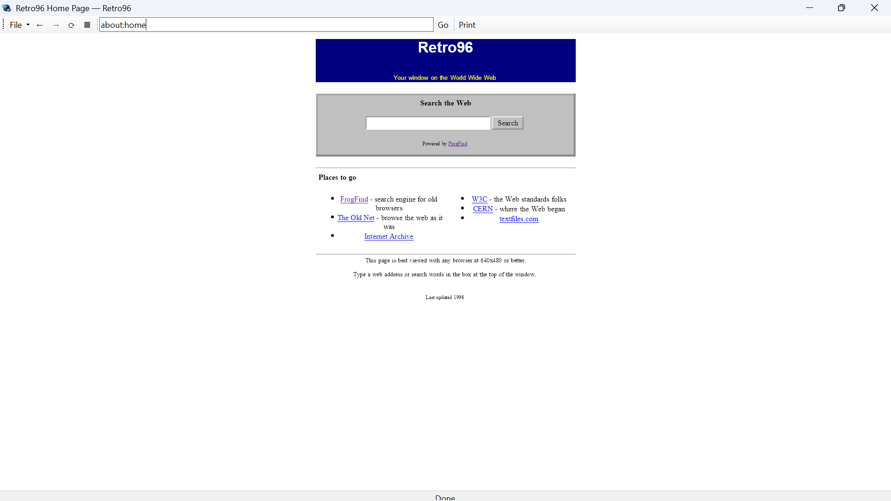
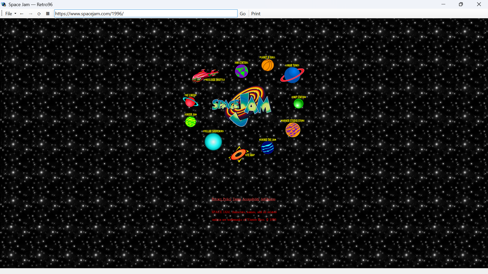
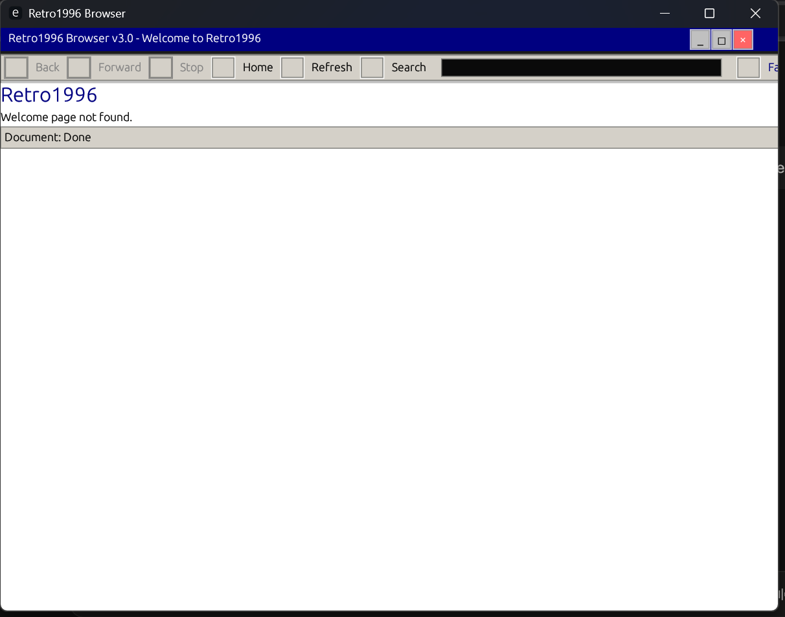
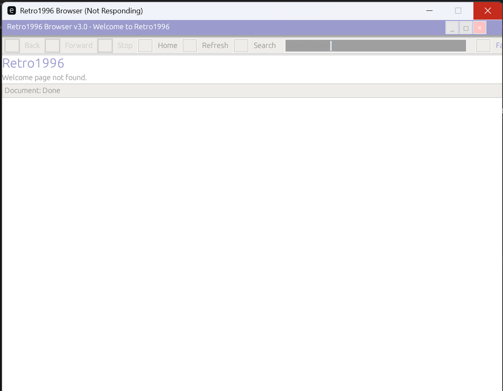
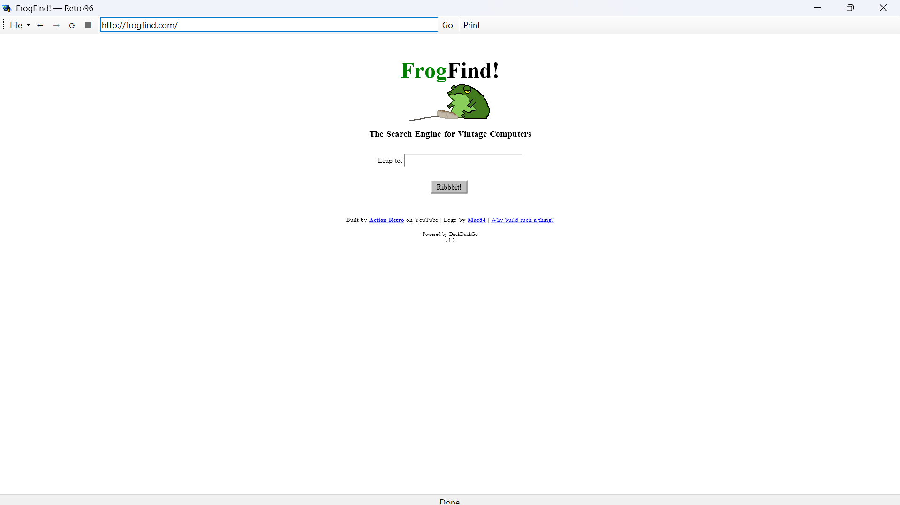

# Retro96

A from-scratch HTML 3.2 / CSS1 / ES3 browser engine that renders the web the way it looked in 1996. Not "mostly." Not "quirks mode close enough." Actually correctly — frames, table layouts, DOM-0 scripting, the whole cursed thing.

Built for fun. Runs on Windows. Has no chill.



## Why does this exist

Because Chrome opened a 1997 Geocities page and said "yeah this looks fine" and it did NOT look fine. The `<blink>` tags weren't blinking. The frames were broken. The Bravenet hit counter JavaScript was dead. Retro96 does not fix things. Retro96 renders things.

## Why use this instead of your "very secure" modern browser

### `<blink>` SUPPORT!!!

ok so you know how every modern browser just. REMOVED `<blink>`. gone. deleted. "accessibility concerns" they said. "we don't want people having seizures" they said. ok fair point actually BUT STILL. Chrome filed it as won't fix. Firefox caved in 2015. every single browser just quietly pretended it never existed and moved on with their lives

I made support for it

not just the tag either. `text-decoration: blink` in CSS? works. `String.prototype.blink()` in JavaScript? works. THREE SEPERATE PLACES TO MAKE YOU SEIZURE THREE TIMES IN A ROW hahaha to make things blink at you. THREE separate implementations of the same feature that the entire browser industry decided was too unhinged to ship. a page could hit you with the tag, then the CSS, then the JS one after another. back to back to back. the browser vendors didn't want that. I wanted that. you're welcome

> ⚠️ **DISCLAIMER: this is a joke and the blink thing is genuinely just for fun and historical accuracy. but for real — if you are photosensitive or prone to seizures please be careful, THREE separate blink mechanisms is not a small amount of blink. we think it's funny. we also think you should look after yourself. those two things can both be true. and if something happens to you, don't call us for medical help**

---

### Authentic period layout

Modern browsers in quirks mode still "helpfully" fix things they shouldn't touch. Retro96 doesn't:

- `align=middle` and `valign=center` — HTML 3.0 alignment synonyms that Chrome just ignores
- table layouts where percentage widths resolve against the *actual containing block*, not vibes
- `margin: auto` centering that works like it did in 1996
- per-side border shorthands that didn't get silently dropped
- `<font>` tags with authored colors that are actually honored instead of overridden by the browser going "actually no"

---

### DOM-0 scripting that isn't dead

`document.formName.fieldName`. `window.status`. The live clock JavaScript that was on every personal homepage in 1999. The Bravenet counter. The guestbook form. Chrome renders these pages and the scripts just don't run. The clock is frozen. The counter shows `sw=undefined`. Retro96 actually implements the DOM the way it worked then so the scripts actually run. wild concept

---

### Frames that work

not "frames mostly load." frames LOAD. nested iframes load. scripts run inside frames. clicking a link in a frame navigates that frame and not the entire window like some kind of animal. it all works because it was all actually implemented

---

Chrome won't add `<blink>` back. people have asked. the issues are closed. Retro96 did not ask

---

## This is a full rewrite of my old Rust project. it was bad. genuinely bad

[Retro1996 (Rust)](https://github.com/DirazCoder/Retro1996) — clone the master branch if you want to see for yourself — was my first attempt at this. it had bookmarks. it had downloads. it had a full feature list in the README. it also had a `crash.txt` in the repo that shows it panicking on a bullet point character inside its own welcome page HTML before it even loads anything from the internet

```
PANIC: panicked at src\engine.rs:740:38:
byte index 8712 is not a char boundary; it is inside '•' (bytes 8711..8714) of `<!DOCTYPE HTML PUBLIC "-//IETF//DTD HTML 2.0//EN">...
```

that's the welcome page. the one it ships with. it crashed loading itself

here's what actually happened under the hood:

**layout engine** — the Rust version had one function that did everything. every element, regardless of what it was, got stacked vertically with a hardcoded `current_y += height + 10.0`. that's it. that's the layout engine. ten pixels. between everything. always. framesets returned an empty node. inline layout didn't exist as a concept. Retro96 has `InlineLayout.cs`, `TableLayout.cs`, `LayoutEngine.cs` — actual separate layout passes, actual inline text flow, actual table column width resolution

**CSS parser** — the Rust one had about 11 property matches across 657 lines. Retro96 has a 807-line parser, a 1063-line computed style system, a 707-line style resolver, and a 391-line selector engine. these are different things that do different things

**JavaScript engine** — both projects have a hand-written JS engine. the Rust one is one 2442-line file. Retro96's is split across a lexer, parser, interpreter, runtime, DOM bindings, AST types, scope — 6617 lines total, each piece doing one job. the Rust DOM bindings had `getElementById`, `createElement`, `write`, `writeln`, `window.status`, `window.location`. that's roughly it. Retro96's `DomBindings.cs` is 1362 lines on its own

**testing** — the Rust repo has a `test_js_engine.rs` file with zero `#[test]` functions in it. Retro96 has 101 xUnit facts, 29 live JS contract checks against real pages, 26 hand-authored QA HTML files, a layout lab, and a Playwright visual diff harness that renders pages side-by-side against Chromium and diffs them pixel by pixel. i tested Retro96 with my eyes AND with actual tests. the Rust one i tested with hope

**real websites** — Retro96 renders theoldnet.com. it renders spacejam.com/1996/. it renders period Geocities pages. the Rust version rendered 0% of 1996 websites correctly — the layout was broken enough that nothing looked right, and the JS engine was broken enough that nothing ran. the bookmarks and downloads worked great though. the thing they were supposed to navigate to did not render

here's spacejam.com/1996/ in Retro96, not photoshopped, not a mockup, just the browser loading the page:



starfield background. planet nav icons. the logo. footer text. all of it.

here's what the Rust version looked like when I fixed it enough to launch and then searched frogfind.com:



it launched. "Welcome page not found." it showed me a fallback page. and then I typed frogfind.com into the address bar



"Not Responding." it froze. on frogfind.com. a website that exists specifically to serve simple HTML to old browsers. the Rust browser looked at the simplest possible website on the internet and said no

and here's frogfind.com in Retro96, loaded instantly, no drama:



both projects are the same size (roughly 25k lines). one of them works

## Status

Side project built for fun, not production software. The engine has a full regression suite (100 xUnit facts, 29 live JS contract checks, a layout lab, and a pixel-diff harness that runs 37 real pages against Chromium).

## Rendering stack

The whole engine draws through SkiaSharp. `Engine/Drawing/` is a `System.Drawing`-shaped wrapper over `SKCanvas`/`SKBitmap`/`SKFont` — nothing links `System.Drawing.Common` or `libgdiplus`, so the engine builds and tests identically on Linux and Windows. The WinForms shell composites each frame onto the Skia surface and hands it to Windows through a single GDI blit — the one unavoidable GDI call in the whole codebase.

## Project layout

```
Retro96-fixed/       the engine + WinForms shell (net11.0-windows)
  Engine/
    Css/              CSS1 parser, selectors, style resolution
    Dom/              DOM node tree
    Drawing/          SkiaSharp-backed drawing primitives
    Forms/            form submission, hit-testing
    Html/             HTML tokenizer + parser
    Js/               hand-written ES3 lexer/parser/interpreter + DOM bindings
    Layout/           block/inline/table layout engine
    Network/          HTTP client, cookies, URL parsing, frame loading
    Render/           renderer, font/image caches, glyph substitution
tests/
  RetroTests/         xUnit regression suite (engine, JS, DOM, forms, frames, CSS1)
  JsPageTests/        live script-contract checks against real pages
  LayoutLab/          layout laboratory + PageProbe (renders a page, dumps diagnostics)
  VisualDiff/         Retro96-vs-Chromium pixel/geometry diff harness (Playwright)
  html-websites/      hand-authored QA pages (HTML 3.2 + CSS1 + ES3)
  reports/            the QA campaign writeup (bug-report.md)
testdata/             real-world period pages + generated era assets
```

## Building

Requires the .NET 8/11 SDKs. Engine and tests run on Linux; the WinForms shell needs `EnableWindowsTargeting` to cross-compile from Linux, or just build it natively on Windows.

```
cd Retro96-fixed
dotnet build -p:EnableWindowsTargeting=true
```

## Running the tests

```
cd tests/RetroTests  && dotnet test      # engine/JS/DOM/forms/frames + CSS1 regressions
cd tests/JsPageTests && dotnet run       # live script-contract checks
cd tests/LayoutLab   && dotnet run       # layout lab, all checks
```

Inspect a single page in detail:

```
cd tests/LayoutLab && dotnet run -- ../../testdata/voyagersisland.html 800 600 png
```

Full visual diff against Chromium (needs `playwright install` once):

```
cd tests/VisualDiff && dotnet run
```

## License

MIT